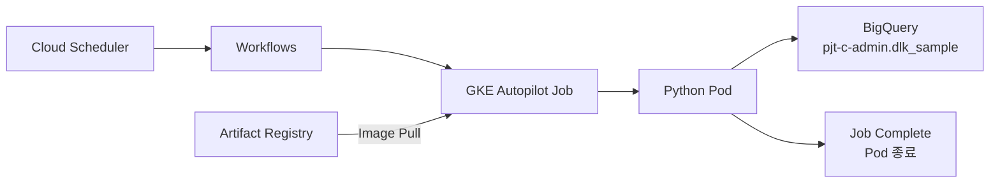
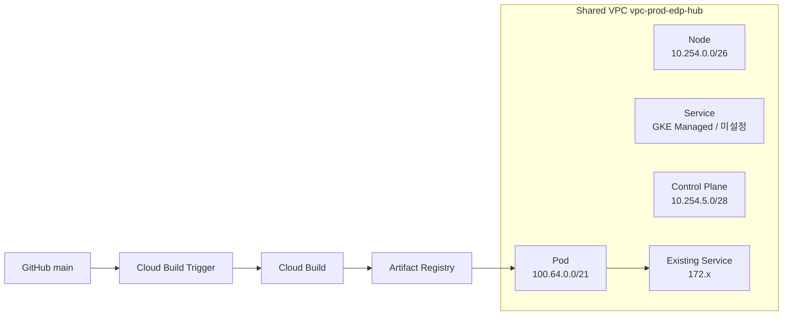

# Gcp_Managed_GKE_L2Comm02

`Gcp_Managed_GKE_L2Comm` 검증 결과를 기준으로 보완한 **GKE Autopilot 기반 L2Comm 배치 TO-BE 설계/구축 소스**입니다.

## 1. TO-BE 핵심 구조

```text
[Source / Image Build - 소스 변경 시만]
GitHub main push
  -> Cloud Build Trigger
  -> Cloud Build
  -> Artifact Registry
  -> python-bq-batch:v1 저장

[Batch Runtime - 매 실행 시]
Cloud Scheduler
  -> Workflows
  -> GKE Autopilot Job
  -> 기존 Artifact Registry Image Pull
  -> Python Batch
  -> BigQuery
  -> Job Complete / Pod 종료
```

> 이미지 Build와 Batch 실행을 분리합니다. Scheduler가 여러 번 실행되어도 소스 변경이 없다면 Docker Image를 매번 Build하지 않습니다.

---

## 2. Project / Resource

| 구분 | Project / Resource | 역할 |
|---|---|---|
| Shared VPC Host | `gcp-prod-edp-hub-vpchost` | VPC/Subnet 소유 |
| Edge / Runtime | `gcp-prod-edp-edge-509423` | GKE, Workflow, Cloud Build, AR, Scheduler |
| Data | `pjt-c-admin` | BigQuery 데이터 저장 |
| VPC | `vpc-prod-edp-hub` | 기존 172 서비스망과 신규 GKE 대역 공존 |
| GKE | `gke-l2comm-batch-an3` | Private GKE Autopilot |
| Artifact Registry | `ar-l2comm-python` | Python batch image |
| Workflow | `wf-l2comm-gke-job` | Kubernetes Job 생성/대기 |
| Scheduler | `sch-l2comm-gke-job` | Workflow 정기 호출 |

---

## 3. Network 설계 - 최종 CIDR

기존 환경은 실제 서비스에 172.x 대역을 사용하고 있으며 IP 여유가 부족합니다.
10.x는 기존 서버대역과 충돌 가능성이 있으므로 Node/Control Plane에 최소 사용하고,
Pod IP는 `100.64.0.0/21`을 사용합니다.

| 구분 | Range | CIDR | 용도 | 설계 의도 |
|---|---|---:|---|---|
| Node Primary | Primary | `10.254.0.0/26` | GKE Node IP | 약 20 Node 환산 + 여유 고려, 10 대역 소비 최소화 |
| Pod Secondary | `pods-prod-edp-l2comm-an3` | `100.64.0.0/21` | Pod IP | 172/10 고갈 회피, 확장성 확보 |
| Service | GKE Managed | 미설정 | ClusterIP Service | 별도 Service Secondary Range 미사용 |
| Control Plane | Master CIDR | `10.254.5.0/28` | Private Control Plane | Autopilot용 Control Plane CIDR 1개 |

### 용량 가정

AS-IS 사용량을 약 `40 vCPU / 900 GB Memory`로 보고, 설계 환산 기준을 `16 vCPU / 64 GB` Node로 가정하면 Memory 기준 약 15 Node가 필요합니다. 30% 안정률 적용 시 약 19 Node이므로 **20 Node 수준**을 설계 기준으로 봅니다.

> Autopilot의 실제 Node 형태/수는 Google이 Pod 요청량에 따라 자동 관리합니다. 위 Node 수는 네트워크/용량 계획을 위한 환산값입니다.

### Routing 원칙

```text
Same Shared VPC

Pod 100.64.x.x
   -> VPC system route
   -> GCP 내부 172.x / 10.x 서비스

On-Prem 172.x
Pod 100.64.x.x
   -> Cloud Router / Interconnect
   -> On-Prem 172.x
   <- Return Route for 100.64.0.0/21 필요
```

- 동일 VPC의 Subnet/Secondary Range 사이에는 별도 Static Route를 추가하지 않습니다.
- Firewall / Hierarchical Firewall / Network Policy는 별도 허용 여부를 확인합니다.
- 온프레미스 172 서비스와 통신할 경우 `100.64.0.0/21`의 BGP 광고 및 Return Route를 확인합니다.
- `10.254.0.0/26`, `10.254.5.0/28`, `100.64.0.0/21`은 기존 사내/VPN/CGNAT 대역과 중복 여부를 구축 전에 확인합니다.

---

## 4. IAM / Service Account

| Principal | 주요 역할 |
|---|---|
| `admin@sonmap.net` | Bootstrap/Network 관리자 |
| `sa-l2comm-inframgr@...` | Infrastructure Manager 실행 |
| `sa-l2comm-cloudbuild@...` | Image Build 및 Artifact Registry Push |
| `sa-l2comm-workflow@...` | GKE Job 생성 / Workflow 실행 |
| `sa-l2comm-runtime@...` | Runtime BigQuery/Compute 접근 |
| `ksa-l2comm-batch` | GKE Workload Identity KSA |
| `541022739403-compute@developer.gserviceaccount.com` | Autopilot Node / Image Pull |

Runtime 기본 권한:
- `roles/bigquery.jobUser`
- `roles/compute.viewer`
- `pjt-c-admin:dlk_sample`에 `roles/bigquery.dataEditor`
- KSA -> GSA `roles/iam.workloadIdentityUser`

---

## 5. 실행 단계

```text
00-bootstrap
   -> API / TF State / Admin SA / Infra Manager SA

10-network
   -> Shared VPC 연결
   -> GKE Node Subnet 10.254.0.0/26
   -> Pod Secondary 100.64.0.0/21
   -> Service Secondary 생성 안 함
   -> Shared VPC IAM

20-source-connection
   -> 기존 Cloud Build GitHub Connection에 L2Comm02 Repository 연결

30-infra-manager
   -> Artifact Registry
   -> Service Accounts / IAM
   -> GKE Autopilot 신규 생성
   -> Cloud Build Trigger
   -> Workflow

40-scheduler
   -> Scheduler 생성
   -> Workflow -> GKE Job 실행
```

현재 GKE Autopilot Cluster는 강제 삭제된 상태를 기준으로 하며,
`10-network`을 최종 CIDR로 맞춘 뒤 `30-infra-manager`에서 재생성합니다.

---

## 6. GitHub / Cloud Build

Cloud Build Trigger는 `main` branch의 아래 경로 변경 시 Image를 자동 Build합니다.

```text
app/**
cloudbuild/**
terraform/30-infra-manager/**
```

정상 운영 시 아래 명령을 매번 실행할 필요가 없습니다.

```text
gcloud builds triggers run ...
```

Git push가 Trigger를 호출하고, Build 성공 시 아래 Image가 생성됩니다.

```text
asia-northeast3-docker.pkg.dev/gcp-prod-edp-edge-509423/ar-l2comm-python/python-bq-batch:v1
```

---

## 7. 최종 Runtime 흐름





---

## 8. 사전 확인 필수

1. `10.254.0.0/26`이 기존 서버망과 중복되지 않는지 확인
2. `100.64.0.0/21`이 사내 CGNAT/VPN/보안장비에서 사용 중인지 확인
3. On-Prem 연동 시 `100.64.0.0/21` Return Route 확인
4. 기존 `github-l2comm` Connection에서 새 Repository 연결
5. 30 단계 전에 `sa-l2comm-inframgr`의 Cloud Build Trigger 생성 권한 확인
6. Artifact Registry Image Pull용 Node SA 권한 확인

## 검증 기준

기존 `Gcp_Managed_GKE_L2Comm` PoC에서는 다음 흐름을 검증했습니다.

```text
Cloud Build SUCCESS
-> Artifact Registry Image 생성
-> Scheduler
-> Workflow
-> GKE Job Complete 1/1
-> BigQuery pjt-c-admin.dlk_sample.gcp_region_inventory
-> 43 rows 적재
```
